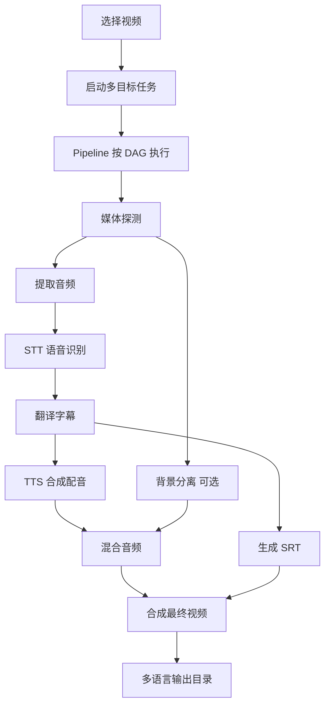

# 多音 · duoyin

AI 驱动的视频字幕翻译与配音桌面工具。Tauri v2 + Vue 3 + Rust，零 Python 运行时。

**流程：** 选择视频 → 提取音频 → 语音识别 → 翻译字幕 → 合成配音 → 输出成片 + SRT



## 快速启动

```bash
npm install
npm run tauri dev
```

## 环境要求

| 工具 | 用途 |
|------|------|
| [Node.js](https://nodejs.org/) >= 18 | 前端构建 |
| [Rust](https://www.rust-lang.org/) >= 1.70 | 桌面应用编译 |
| [FFmpeg](https://ffmpeg.org/) | 视频/音频处理 |

## 支持的引擎

| 类别 | 引擎 | 说明 |
|------|------|------|
| STT | SenseVoice / Whisper (candle) / OpenAI API / whisper.cpp | 本地优先 |
| 翻译 | DeepSeek 等 OpenAI 兼容 API | 需 API Key |
| TTS | Supertonic 3 (ONNX) / ZipVoice (零样本) / CosyVoice3 (方言) | 本地优先 |
| 分离 | UVR-MDX (sherpa-onnx) | 可选，保留原视频 BGM |

## 测试

```bash
npm test                        # 前端单测
cd src-tauri && cargo test      # 后端单测/集成测试
npm run e2e                     # 真机回归（需本地模型）
```

## 技术栈

| 层 | 技术 |
|------|------|
| 桌面框架 | Tauri v2 |
| 前端 | Vue 3 + TypeScript + Naive UI |
| 后端 | Rust |
| 推理 | ONNX Runtime (CPU) / candle |

## 文档

详细架构文档见 `docs/` 目录。
