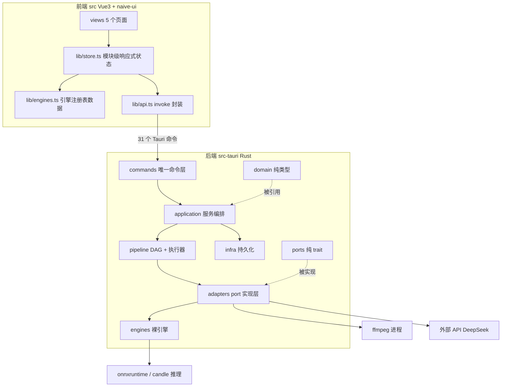

# VideoTrans Tauri — 全局架构（当前状态，唯一权威）

> 本文是架构的**当前状态**描述（非历史设计稿）。其他 AI 凭本文 + README + 各模块 `ARCHITECTURE.md` 应能完整复现本项目。
> 历史重构决策见 `docs/archive/BACKEND_ARCHITECTURE_v2_refactor_plan.md`（已归档，勿当现状读）。

## 1. 系统分层总图



## 2. 依赖方向（铁律，已实测零违规）

```text
commands → application → pipeline → adapters → engines
              │                        │
              └── infra                └── ports（adapters 实现 ports；engines 不依赖 ports）
```

| 规则 | 说明 |
|---|---|
| 只允许向下 | 上层可引下层，反向禁止（CI 级纪律：`pipeline/` 不得 `use crate::commands` 等） |
| `engines/` 不依赖 `ports/` | 引擎是裸实现；port 语义（资源成本、契约校验）在 `adapters/` 注入 |
| `legacy/` 是隔离区 | 旧单目标流程（`start_task`），仅紧急回滚用；**任何非 legacy 模块禁止引用它**（实测零引用） |
| `domain/` `ports/` 纯类型 | 无 IO、无依赖，被上层共享 |

新增引擎的落点：`engines/` 加实现 → `adapters/` 加包装 → `pipeline_service.rs` 加注册分支（详见 `engines/ARCHITECTURE.md`）。

## 3. 模块地图与文档索引

| 模块 | 职责一句话 | 规模 | 详细文档 |
|---|---|---|---|
| `src/lib/`（前端） | 模块级 store + invoke 封装 + 引擎注册表数据 | ~1.6k 行 | [`src/lib/ARCHITECTURE.md`](../src/lib/ARCHITECTURE.md) |
| `src/views/`（前端） | 5 页面：工作台/任务队列/字幕编辑/媒体工具/设置 | ~2.7k 行 | 同上 |
| `commands/` | 31 个 `#[tauri::command]`，唯一 IPC 层（薄，转调 application） | ~1.2k 行 | 本文 §4 |
| `application/` | 服务编排：流水线组装、任务 CRUD、字幕编辑、音色参考 | ~1.9k 行 | [`src-tauri/src/application/ARCHITECTURE.md`](../src-tauri/src/application/ARCHITECTURE.md) |
| `pipeline/` | DAG 定义 + 执行器（复用/降级/取消/记录） | ~2.4k 行 | [`src-tauri/src/pipeline/ARCHITECTURE.md`](../src-tauri/src/pipeline/ARCHITECTURE.md) |
| `adapters/` | ports 的全部实现（stage 执行器 + 引擎包装） | ~3.4k 行 | [`src-tauri/src/adapters/ARCHITECTURE.md`](../src-tauri/src/adapters/ARCHITECTURE.md) |
| `engines/` | 裸引擎：STT×4 / 翻译×1 / TTS×3 | ~2.8k 行 | [`src-tauri/src/engines/ARCHITECTURE.md`](../src-tauri/src/engines/ARCHITECTURE.md) |
| `domain/` + `ports/` | 纯类型 / 纯 trait | ~1k 行 | 本文 §5 |
| `infra/` | task_store（任务+索引+manifest）/ artifact_store / api_client | ~2k 行 | 本文 §6 |
| `legacy/` | 【冻结】旧单目标流程，仅回滚 | ~600 行 | 本文 §7 |
| crate 根散件 | `scheduler` / `memcheck` / `tts_dub` / `segments` / `logger` 等 | ~2.5k 行 | 本文 §8 |

## 4. commands/ —— IPC 契约

31 个命令按文件分组（完整清单见 `docs/PROJECT_MAP.md` §6）：`config.rs`（配置读写/文件选择/日志）、`task.rs`（start_multi_target_task / cancel）、`tasks.rs`（持久化任务 CRUD / 字幕读写 / 方言 / 模型下载）、`api_test.rs`、`media_tools.rs`、`runtime.rs`、`realtime_stt.rs`、`diarization.rs`。命令层只做参数校验 + 转调 application/state，不写业务。

## 5. ports/ —— 5 个引擎契约（trait）

| trait | 核心方法 | port 层契约校验 |
|---|---|---|
| `SttEngine` | `transcribe(audio, lang, cancel) → Vec<Segment>` | `sanitize_segments`：统一清洗（零宽/空白）+ 非空 + 时间有效 |
| `Translator` | `translate(segments, lang, target, cancel) → Vec<Segment>` | — |
| `TtsEngine` | `synthesize(segments, target, ...) → TtsOutput` | `validate_tts_input`：译文非空才进 TTS |
| `AudioSeparator` | `separate(input, staging, ...) → SeparationOutput` | — |
| `MediaTool` | `probe` / `extract_stt_audio` | `validate_media_info`：时长/编码/尺寸非零 |

所有 trait 都有 `resource_cost()`（默认轻量，重引擎在 adapters 覆盖）。

## 6. infra/ —— 持久化

- `task_store.rs`：`%LOCALAPPDATA%/videotrans/tasks/{id}/` 下的 task.json / manifest.json / index.json；原子写；`delete_task` 删目录+索引（幂等，运行中拒绝）
- `artifact_store.rs`：产物路径解析 + 内容寻址哈希（断点复用的依据）
- `api_client.rs`：HTTP 客户端（并发限制 + 间隔节流，翻译 API 用）

## 7. legacy/ —— 冻结区

`command.rs`（`start_task`，IPC 名保留）+ `process.rs`（旧单目标 run）+ `ffmpeg.rs`（旧工具）。移除标准见归档文档 §6。**新代码禁止依赖。**

## 8. crate 根散件

| 文件 | 职责 |
|---|---|
| `scheduler.rs` | 资源闸门：`Cost{cpu, ram_bytes}` 按引擎分档（sensevoice 1200MB / whisper 3900MB / TTS 1200MB），`admit()` 做 commit 预审，RAII `Lease` Drop 释放；重 CPU 阶段全局串行 |
| `memcheck.rs` | Windows commit 限额探测（`GlobalMemoryStatusEx.ullAvailPageFile`），STT 开工前选 30s/15s 窗口或拒绝 |
| `tts_dub.rs` | TTS 三引擎共用：`TimelineWriter`（流式写 WAV + 段间静音）+ 时长对齐（rubberband 变速 85%~125%） |
| `segments.rs` | 字幕段清洗/校验（STT 出口统一过这里） |
| `voice_ref.rs` 在 application | 原声克隆参考段提取（挑最长 3~20s 段 + ffmpeg 截取） |
| `logger.rs` | 日志 + panic hook + failures.jsonl；测试下重定向临时目录 |
| `audio_io.rs` | 音频流式窗口读取（STT 引擎共用，30s 窗防 OOM） |
| `subtitle*.rs` / `text_align.rs` / `audio_align.rs` | SRT/ASS 生成、文本对齐 |

## 9. 关键横切约束（改代码前必读）

1. **内存预审优先**：推理中段 OOM 无法救（ORT 异常穿 extern "C" 直接 abort）——重资源开工前必须走 `scheduler::admit`。
2. **流式处理**：音频/TTS 一律分块流式，禁止全长 buffer（47 分钟 f32 = 505MB 的教训）。
3. **状态提升**：前端状态一律放模块级 `store.ts`，禁止 `v-if` 存局部 ref（切页丢状态）。
4. **Tauri command 必须 `async fn`** 才能内部 `tokio::spawn`（否则 panic: no reactor）。
5. **测试基线**：`cargo test` 204/7 + `npm test` 27 全绿才算过；改主流程同步 `docs/FUNCTION_CHECKLIST.md`。
6. **配置默认值双端同步**：`types.rs` `default_*` 与 `engines.ts` `DEFAULT_CONFIG` 任一处改动必须同步另一处 + 两侧契约测试。
