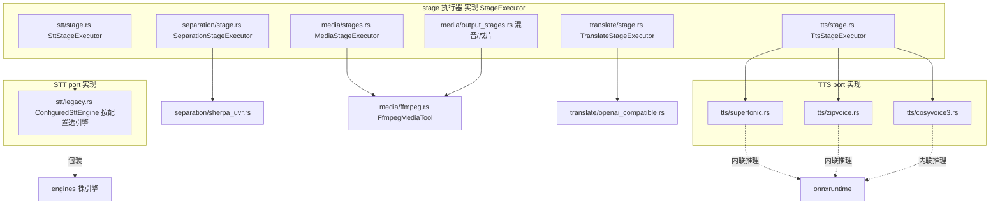

# adapters/ —— ports 实现层

> 职责一句话：把「裸引擎」包装成 `ports/` 的 trait 实现，注入资源成本声明与契约校验；并提供各 pipeline stage 的执行器。
> 全局位置见 `docs/ARCHITECTURE.md`。

## 1. 结构与接线矩阵

| 目录 | 文件 | 实现/包装 | 消费方 |
|---|---|---|---|
| media/ | `ffmpeg.rs` | `MediaTool` port（ffmpeg 子进程：probe/extract） | MediaStageExecutor + e2e |
| media/ | `stages.rs` | media_probe / extract_audio 两 stage | registry |
| media/ | `output_stages.rs` | mix / srt / final_video 三 stage（混音、SRT、ffmpeg 混流） | registry |
| stt/ | `stage.rs` | stt stage（调度器准入 + 引擎调用 + sanitize 出口） | registry |
| stt/ | `legacy.rs` | `ConfiguredSttEngine`：读 AppConfig 按 `stt_engine` 字段分发到 engines/stt/* | stt/stage |
| stt/ | `sensevoice.rs` | sensevoice 直连（VAD 门控变体） | 备用路径 |
| translate/ | `stage.rs` | translate stage（**重试 3 次退避 0.8/1.6s**；仍败→原文回填 + Degraded） | registry |
| translate/ | `openai_compatible.rs` | `Translator` port（限流/节流/代理，走 infra/api_client） | translate/stage |
| tts/ | `stage.rs` | tts stage（时间轴对齐 TtsAlignment + 可选原声参考注入） | registry |
| tts/ | `supertonic.rs` / `zipvoice.rs` / `cosyvoice3.rs` | `TtsEngine` port 三实现 | tts/stage |
| separation/ | `stage.rs` | separation stage（降噪/归一化后处理开关） | registry |
| separation/ | `sherpa_uvr.rs` | `AudioSeparator` port（UVR-MDX-NET onnx） | separation/stage |

## 2. 资源成本与准入（scheduler 集成）

| 引擎/阶段 | Cost（cpu, ram） | 来源 |
|---|---|---|
| STT sensevoice | (1, 1200MB) | `scheduler::stt("sensevoice")` |
| STT whisper_native 等 | (1, 3900MB) | `scheduler::stt(_)` 默认档 |
| TTS 全部 | (1, 1200MB) | `scheduler::TTS` 常量 |
| 翻译 / 字幕 / 纯 IO | (0, —) 不占调度 | LIGHT |

- 重 CPU 阶段（STT/TTS/分离）**全局同时只跑一个**（信号量闸门）；准入前 `memcheck` 校验 Windows commit 可用内存，不足直接拒绝而不是跑到一半 abort。
- RAII `Lease` 必须保持在 **executor 主方法作用域**（移进子方法会提前释放额度——历史坑）。

## 3. TTS 共用时间轴（`tts_dub.rs` 在 crate 根）

三引擎（supertonic/zipvoice/cosyvoice3）共用：
1. 逐段 `synthesize` → `TimelineWriter` 流式写 WAV（段间补静音，禁止全长 buffer）
2. `align_i16_to_duration`：超时段 rubberband 变速（85%~125%，配置可调）
3. 产物统一 `targets/{variant}/dub.wav`

**原声克隆**（`tts_use_video_prompt` 开启时）：tts stage 先经 application/voice_ref 提取参考段（原视频最长 3~20s 语音 + ffmpeg 截取），再经 `TtsEngine::with_task_reference` 任务级覆盖全局参考音频。

## 4. 对外契约

- **上游**（application）：`pipeline_service.rs` 在此注册全部 stage（见 `application/ARCHITECTURE.md` §2）。
- **下游**（engines）：只依赖裸引擎公开 API，不触碰引擎内部件。
- **契约测试**：`ports/*.rs` 内 `assert_*_contract` 函数（Fake 引擎也要过契约）——新 port 实现必须过同款契约。

## 5. 改动指引

- 加新 TTS 引擎：`tts/` 加 port 实现（复用 `tts_dub` 时间轴）→ `pipeline_service::register_tts` 加 match 分支 → scheduler 成本一行。
- 改 STT 出口行为：只动 `stt/stage.rs` 的 sanitize 调用点（port 边界统一清洗是铁律，勿在单个引擎内私洗）。
- mix/final 产物路径：`media/output_stages.rs` + `infra/artifact_store.rs` 路径映射同步改。
