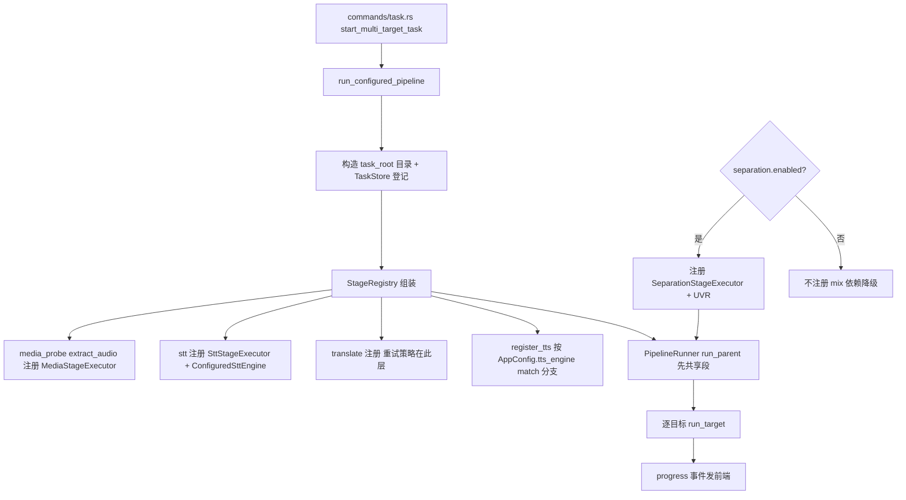

# application/ —— 服务编排层

> 职责一句话：把 commands 的请求组装成可执行的流水线（装配引擎注册表 + 驱动 runner），并承载任务 CRUD、字幕编辑、方言、音色参考等应用服务。
> 全局位置见 `docs/ARCHITECTURE.md`。

## 1. 文件构成

| 文件 | 职责 |
|---|---|
| `pipeline_service.rs` | **核心装配**：见 §2 |
| `task_service.rs` | 持久化任务包装：创建/列举/载入/删除（调 infra/task_store） |
| `checkpoint.rs` | 断点恢复：启动时 reconcile 磁盘 manifest 与产物（调 runner.reconcile_artifacts） |
| `subtitle_edit.rs` / `subtitle_import.rs` | 字幕段读写 / SRT 导入（编辑后触发下游失效 invalidate） |
| `dialects.rs` | 语言-方言规格（如 zh→zh-CN/zh-yue） |
| `voice_ref.rs` | 原声克隆参考段提取：挑最长 3~20s 且文本≥2 字的段 + ffmpeg 截取 → `shared/ref_voice.{wav,txt}` |

## 2. 流水线装配流程（`run_configured_pipeline`）

`register_tts` 的 match 分支：`cosyvoice3` / `supertonic`（方言与中文扩展校验在注册期失败，**在昂贵 STT 之前**报错）/ `zipvoice`。

`validate_pipeline_configuration`：任务启动前的预检（同一条注册路径走一遍，配置错直接拒）。

## 3. 降级与恢复语义（与 pipeline 的分工）

- application 决定「何时装配什么引擎」；pipeline 决定「某阶段失败后整任务走向」。
- 翻译重试 + 原文回填 Degraded：策略在 adapters/translate/stage；任务级标记在 runner。
- 应用重启恢复：`checkpoint.rs` 扫 tasks/ 目录 → `reconcile_artifacts`（记录与产物对不上即失效该记录，重跑该阶段）。

## 4. 对外契约

- **上游**：commands 层全部业务转调这里（命令层不写业务）。
- **下游**：pipeline（runner + registry）、infra（task_store / artifact_store）、adapters（各 executor 构造）。
- `start_multi_target_task` 入参：video / sourceLanguage / targets[] / existingTaskId（续跑已有任务）。

## 5. 改动指引

- 加引擎分支：只动 `register_tts`（或 stt 的 ConfiguredSttEngine），勿在 runner 里塞引擎逻辑。
- 改任务目录布局：`infra/task_store.rs` + `docs/TASK_PIPELINE_ARCHITECTURE.md` 同步（那里有完整目录树）。
- 改字幕编辑联动：subtitle_edit 的保存点调用 `invalidate_from` 使下游（tts/mix/final）重跑。
