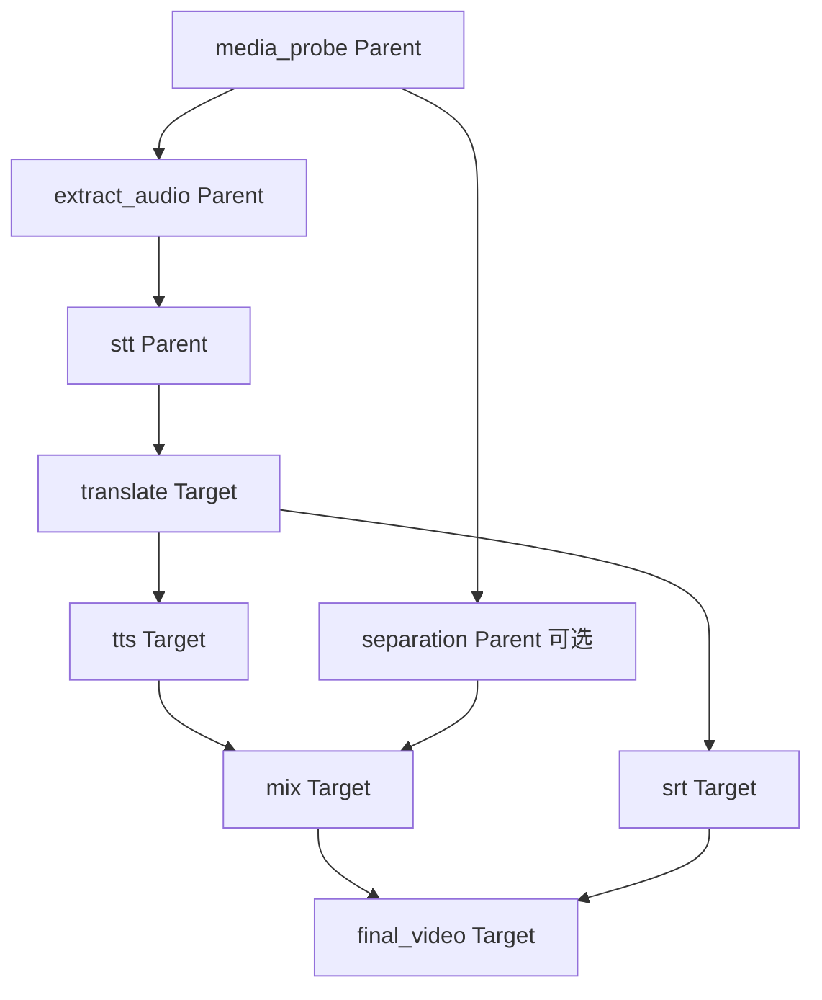
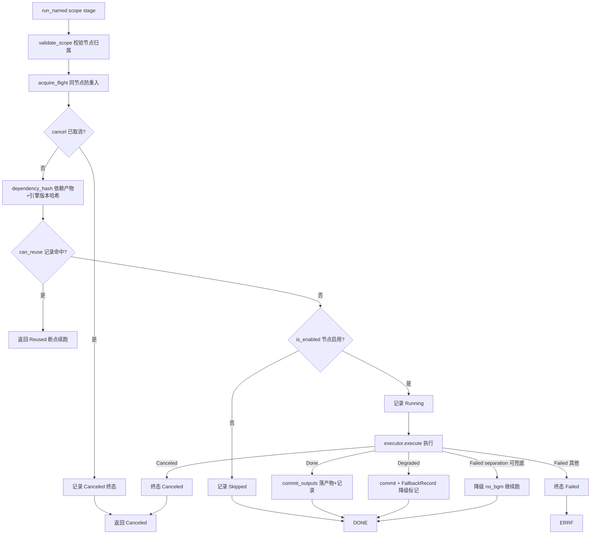

# pipeline/ —— DAG 与执行器

> 职责一句话：定义「视频翻译」的阶段依赖图（DAG），并按图执行——**能复用就复用、能降级就降级、随时可取消、每步落记录**。
> 全局位置见 `docs/ARCHITECTURE.md`；任务磁盘布局见 `docs/TASK_PIPELINE_ARCHITECTURE.md`。

## 1. 文件构成

| 文件 | 职责 |
|---|---|
| `graph.rs` | DAG 定义（`PipelineGraph::video_translation()` 唯一内置图）+ 拓扑序 + 后代查询 |
| `registry.rs` | `StageRegistry`：stage 名 → `Arc<dyn StageExecutor>` 注册表 |
| `runner/mod.rs` | re-export 门面（外部只 `use crate::pipeline::runner::*`） |
| `runner/types.rs` | `RunScope` / `CancelToken` / `StageRequest` / `ExecutionOutcome` / `PipelineError` 等 |
| `runner/records.rs` | stage 记录读写（复用判定 / 失效传播） |
| `runner/executor.rs` | `PipelineRunner<E>` 核心（字段顺序与 Drop 顺序冻结，改动需评审） |
| `runner/tests.rs` | 全部测试（必须保持 runner 子模块身份以访问私有项） |
| `integration_tests.rs` | 跨模块集成测试（真实 ffmpeg 冒烟等） |

## 2. 内置 DAG（`video_translation`）

| 节点 | scope | 依赖 | 产物（ArtifactKind） |
|---|---|---|---|
| media_probe | Parent | — | MediaInfo |
| extract_audio | Parent | media_probe | ExtractedAudio（audio.wav） |
| separation | Parent（optional） | media_probe | VocalsRaw + BackgroundRaw |
| stt | Parent | extract_audio | Segments（stt/segments.json） |
| translate | Target | stt | TranslatedSegments |
| tts | Target | translate | DubAudio（dub.wav） |
| mix | Target | tts + separation | MixedAudio（mixed.wav） |
| srt | Target | translate | SubtitleSrt |
| final_video | Target | mix + srt | FinalVideo |

**Parent 一次，Target 每目标语言一次**——多语言任务共享 probe/extract/stt，各目标独立 translate→tts→mix→srt→final。

## 3. 执行器状态机（`run_named` 每阶段决策流）

关键语义：

- **Reused**：依赖哈希未变 + 上次成功 → 跳过执行（重启恢复 / 编辑字幕后只重跑下游的基石）。`invalidate_from` 沿 DAG 后代传播失效。
- **Degraded**：产出可用但质量降级（翻译 IncompleteResult 原文回填、separation 失败转 no_bgm），manifest 记 `FallbackRecord`，任务标记 PartiallyFailed/Degraded 而非失败。
- **并发模型**：`run_parent` 先跑全部 Parent 节点，`run_targets_with_tokens` 再逐目标跑 Target；跨目标并行能力已预留（`run_targets`）但生产路径串行（内存闸门）。

## 4. 对外契约

- **上游**（application）：`run_configured_pipeline` 组装 `StageRegistry` 后构造 `PipelineRunner` 并驱动 `run_parent` / `run_target`。
- **下游**（adapters 的 StageExecutor）：`execute(StageRequest, ExecutionContext) -> ExecutionOutcome`；`ExecutionContext` 携带 `task_root` + `CancelToken`。
- **观察者**：`PipelineObserver` 收进度事件（经 commands 层 emit 给前端 `progress` 监听）。

## 5. 改动指引

- 加新阶段：`graph.rs` 加 `StageNode`（勿破坏拓扑序测试）→ adapters 加 executor → `pipeline_service.rs` 注册。
- 改执行顺序/降级策略：只动 `executor.rs` 的 `run_named`；改完必跑 `runner/tests.rs`（79 个用例覆盖复用/降级/取消矩阵）。
- 内部件可见性用 `pub(in crate::pipeline::runner)`，禁止升 `pub(crate)`（历史决策，防门面断链）。
