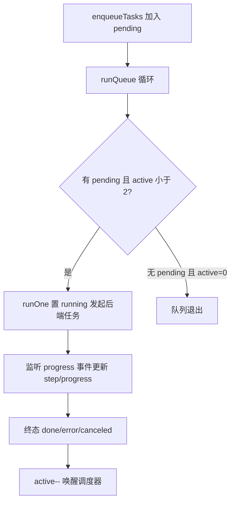

# src/lib/ —— 前端状态与 API 层（+ views 职责）

> 职责一句话：模块级响应式 store（切页不丢状态）+ Tauri invoke 封装 + 数据驱动的引擎注册表；views 只做展示与交互。
> 全局位置见 `docs/ARCHITECTURE.md`。

## 1. 文件构成

| 文件 | 职责 |
|---|---|
| `store.ts` | **唯一全局状态**：`reactive(store)` 模块级单例 + 队列调度（§2） |
| `api.ts` | 全部 `invoke()` 封装（IPC 名与后端一一对应）+ 事件监听 |
| `engines.ts` | `STT_ENGINES` / `TTS_ENGINES` 数据表（key/label/fields/ready）+ `DEFAULT_CONFIG` |
| `variants.ts` | 工作台交互纯函数（方言展开 / 高阶功能标签 / 草稿归一校验，从 HomePage 抽出，vitest 直测） |
| `types.ts` | 与后端 `types.rs` 对齐的 TS 类型（AppConfig / Segment / TaskItem…） |
| `srt.ts` / `ass.ts` | 字幕序列化/解析 |
| `langs.ts` | 语言与方言清单 |

## 2. 队列调度状态机（store.ts 核心逻辑）

- `MAX_CONCURRENT = 2`：前端双任务并行——**真正的资源互斥在后端**（重 CPU 信号量全局唯一），所以并行的两个任务里，一个跑重资源阶段时另一个恰好等外部 API。
- 状态提升铁律：任何跨页状态放 `store.ts`，禁止组件内 `ref` + `v-if` 存状态（切页即丢）。
- 历史任务恢复：`restorePersistentTasks` 把后端 `list_persistent_tasks` 的 summary 映射成 TaskItem（shared_stages / children 状态映射）。

## 3. 视图职责（src/views/）

| 视图 | 职责 | 关键交互 |
|---|---|---|
| `HomePage.vue`（959 行，最大） | 工作台：选视频/语言/目标 + 9 步进度条 + 队列摘要 | 步骤条 `flex-wrap` 自适应；预览行常驻占位防抖动；高阶功能保存后扩散光晕 + 常驻标签 |
| `TasksPage.vue` | 任务队列 + 历史任务（恢复/删除/取消子任务） | 删除先 invoke `delete_persistent_task` 成功再本地 splice |
| `SubtitlePage.vue` | 字幕编辑（双列对照/导入 SRT/保存触发下游失效） | 编辑态在 store.subtitleEditor |
| `ToolsPage.vue` | 媒体工具（剪辑/分离/合并/文本对齐 SRT） | 独立命令，不走流水线 |
| `SettingsPage.vue` | 引擎配置表单（由 engines.ts 数据驱动渲染） | 保存 = save_config 持久化到 exe 目录 config.json |

`src/components/`：7 个纯展示组件（PathPicker / FileDrop / ConfigFields / AppSidebar / PageHeader / Icon / ApiTestButton）。

## 4. 前后端契约

- **IPC**：31 个命令名（`api.ts` ↔ `lib.rs invoke_handler` 一一对应，改名双侧同步）。
- **事件**：后端 emit `progress`（任务/子任务/stage/进度/错误），前端 store 统一消费分发；`tauri-drag-drop`（拖拽文件）。
- **配置默认值**：`DEFAULT_CONFIG`（本文件）与后端 `types.rs` `default_*` **双端对齐**，任一改动同步另一处 + 契约测试（engines.test.ts）。
- **引擎 ready 判定**：数据驱动——`STT_ENGINES[].ready(config)` 只看对应路径字段非空。

## 5. 改动指引

- 加设置字段：`types.rs`（serde default）+ `types.ts` + `engines.ts`（字段表或 DEFAULT_CONFIG）三处同步，旧 config.json 靠 serde default 无缝升级。
- 改队列行为：只动 `runQueue/runOne`；改完必跑 `npm test`（队列调度有用例）。
- 前端运行期异常自动转发后端日志（`log_frontend` 命令，`[frontend]` 前缀）——排查 UI 问题去后端日志找。
